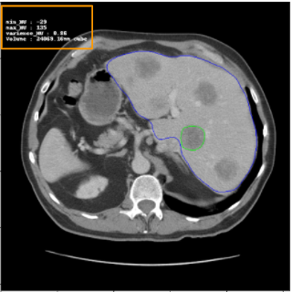
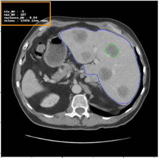
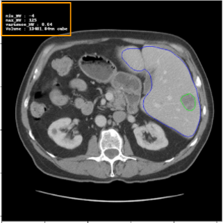
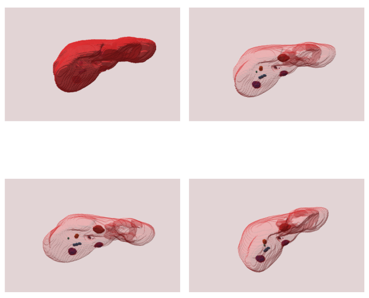
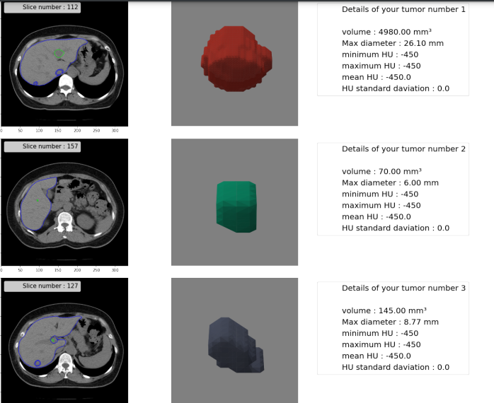

# Liver-Tumor-Segmentation
Segmentation of Liver Tumor using HDense on LITS Dataset  
### Dataset:  
The LITS dataset contains CT scans of patients and annotations for tumor and liver segmentation masks. Whole dataset includes 130 scans.  
Link to dataset used: https://academictorrents.com/details/27772adef6f563a1ecc0ae19a528b956e6c803ce  
  
### Results:
Dice Score achieved: 71%  
  
The contoured Liver and Tumor can be seen as:  
 
 
 
 
Results were presented as shown below in 3D for each patient:  
   
  

A report for each patient is compiled in pdf format.
